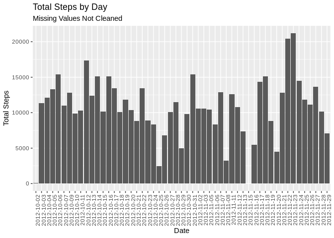
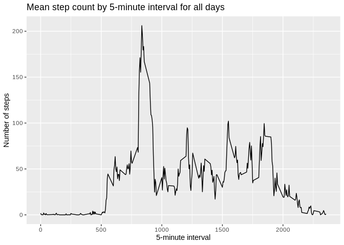
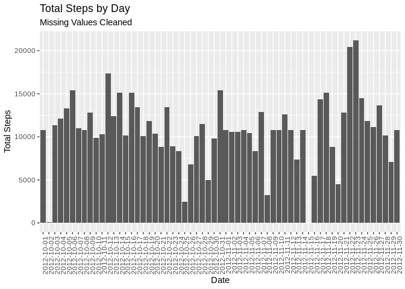
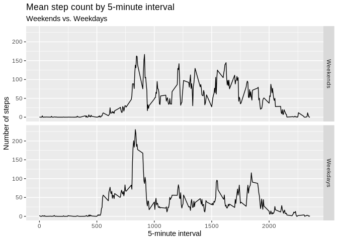

## Loading and preprocessing the data
### Assignment
Show any code that is needed to

1. Load the data (i.e. read.csv()).
1. Process/transform the data (if necessary) into a format suitable for your analysis.

### Solution
* Load some libraries we'll need.
* Get the data. Data for this project are located in the fork of the provided GitHub repo. Unzip it and load it.


```r
library(ggplot2)
library(dplyr)
```

```
## 
## Attaching package: 'dplyr'
```

```
## The following objects are masked from 'package:stats':
## 
##     filter, lag
```

```
## The following objects are masked from 'package:base':
## 
##     intersect, setdiff, setequal, union
```

```r
unzip(zipfile = "activity.zip")
activity <- read.csv("activity.csv", stringsAsFactors = FALSE)
```

## What is mean total number of steps taken per day?
### Assignment
For this part of the assignment, you can ignore the missing values in the dataset.

1. Make a histogram of the total number of steps taken each day.
2. Calculate and report the mean and median total number of steps taken per day.

### Notes
* Steps are recorded in 5-minute intervals. A day has multiple intervals. The question asks for a statistic on an aggregation. The aggregation is sum of steps, grouped by day. We need that first.
* I like to think of this the SQL way, and when I think that way I reach for _dplyr_.
* One question I would like to answer for taking away from this assignment. If there are NA values present in the detail, does that make an entire level of group by return NA, even if some of the values for that group do exist? Answer: yes, it does.
* Since I made a frequency table, I don't want the histogram to apply a statistical method. Just
report the numbers. Code as: stat = "identity". 

### Solution
1. Create a data frame that sums steps grouped by day.
1. Find the mean and median of those sums.
1. Plot a histogram for the total steps taken each day.


```r
steps_tot_by_day <- select(activity, steps, date) %>%
        filter(!is.na(steps)) %>% # The assignment says don't clean, but I can't summarize
                                  # unless I filter.
        group_by(date) %>%
        summarize(sum(steps))

tot_steps_mean <- mean(steps_tot_by_day$`sum(steps)`)
tot_steps_median <- median(steps_tot_by_day$`sum(steps)`)

ggplot(data = steps_tot_by_day, aes(x = date, y = `sum(steps)`)) +
        geom_histogram(stat = "identity") +
        labs(title = "Total Steps by Day", subtitle = "Missing Values Not Cleaned",
             x = "Date", y = "Total Steps") +
        theme(axis.text.x = element_text(angle = 90, hjust = 1))
```

```
## Warning: Ignoring unknown parameters: binwidth, bins, pad
```

<!-- -->

### Report results
- Mean total number of steps taken per day: 10766.19.
- Median total number of steps taken per day: 10765.

## What is the average daily activity pattern?
### Assignment
1. Make a time series plot (i.e. type = "l") of the 5-minute interval (x-axis) and the average number of steps taken, averaged across all days (y-axis).
1. Which 5-minute interval, on average across all the days in the dataset, contains the maximum number of steps?

### Solution
- Reaching for dplyr again.

### Notes
This is an instructive example for me because it answers my question about how NA values affect dplyr aggregations.

### Bad plot
This does not satisfy the assignment, but for my own pleasure and understanding, I'm running this the
wrong way. (I can do that.) The query lacks a filter and spoils the summary.

```r
daily_activity <- select(activity, steps, interval) %>%
        group_by(interval) %>%
        summarize(mean(steps))

head(daily_activity)
```

```
## # A tibble: 6 x 2
##   interval `mean(steps)`
##      <int>         <dbl>
## 1        0            NA
## 2        5            NA
## 3       10            NA
## 4       15            NA
## 5       20            NA
## 6       25            NA
```

*That's* not good! I must filter NA values. Try again...


```r
daily_activity <- select(activity, steps, interval) %>%
        filter(!is.na(steps)) %>%
        group_by(interval) %>%
        summarize(mean(steps))

head(daily_activity)
```

```
## # A tibble: 6 x 2
##   interval `mean(steps)`
##      <int>         <dbl>
## 1        0        1.72  
## 2        5        0.340 
## 3       10        0.132 
## 4       15        0.151 
## 5       20        0.0755
## 6       25        2.09
```
### Ready to plot the answer

```r
ggplot(data = daily_activity) +
  geom_line(mapping = aes(x = interval, y = `mean(steps)`)) +
  labs(title = "Mean step count by 5-minute interval for all days",
       x = "5-minute interval",
       y = "Number of steps")
```

<!-- -->

```r
max_df <- select(daily_activity, interval, `mean(steps)`) %>%
           summarise(max_steps = max(`mean(steps)`),
                     # max_interval = interval[which(`mean(steps)` == max(`mean(steps)`))])
                     max_interval = interval[which.max(`mean(steps)`)])

max_interval <- max_df$max_interval
```
The 5-minute interval with the maximum average steps is: 835. 

## Imputing missing values
### Assignment
Note that there are a number of days/intervals where there are missing values (coded as NA). The presence of missing days may introduce bias into some calculations or summaries of the data.

1. Calculate and report the total number of missing values in the dataset (i.e. the total number of rows with NAs)
1. Devise a strategy for filling in all of the missing values in the dataset. The strategy does not need to be sophisticated. For example, you could use the mean/median for that day, or the mean for that 5-minute interval, etc.
1. Create a new dataset that is equal to the original dataset but with the missing data filled in.
1. Make a histogram of the total number of steps taken each day and Calculate and report the mean and median total number of steps taken per day. Do these values differ from the estimates from the first part of the assignment? What is the impact of imputing missing data on the estimates of the total daily number of steps?

### Solution
1. The function is.na() returns a logical value. Add them up and you have the count.
1. Replace missing values with the mean across all days for that interval.
1. _dplyr_'s inner join function can get the means for each interval onto its associated rows.
However, an update in place of the steps column is not native to _dplyr_. Use base _within_ notation.
1. Copy the histogram and statistics from the first chunk and substitute the clean data frame.
1. The results show that cleaning did not change the mean, but it did change the median.

### Notes
* dplyr doesn't appear really to have syntax comparable to SQL's UPDATE. Use WITHIN and an assignment
in the execute block. Refer to Zelzny7's comment responding to me on
[StackOverflo](https://stackoverflow.com/questions/28650957/update-a-value-in-one-column-based-on-criteria-in-other-columns)


```r
na_count <- sum(is.na(activity$steps))

# Get on the same row: steps and the mean steps for that interval.
activity_na_clean <- left_join(activity, daily_activity, by = "interval")
# Update steps where is NA.
activity_na_clean <- within(activity_na_clean, steps[is.na(steps)] <- `mean(steps)`)
```

```
## Warning in steps[is.na(steps)] <- `mean(steps)`: number of items to replace
## is not a multiple of replacement length
```

```r
# Drop mean
activity_na_clean <- activity_na_clean[ , 1:3]

steps_tot_by_day_clean <- select(activity_na_clean, steps, date) %>%
        filter(!is.na(steps)) %>%
        group_by(date) %>%
        summarize(sum(steps))

tot_steps_mean_clean <- mean(steps_tot_by_day_clean$`sum(steps)`)
tot_steps_median_clean <- median(steps_tot_by_day_clean$`sum(steps)`)

ggplot(data = steps_tot_by_day_clean, aes(x = date, y = `sum(steps)`)) +
        geom_histogram(stat = "identity") +
        labs(title = "Total Steps by Day", subtitle = "Missing Values Cleaned",
             x = "Date", y = "Total Steps") +
        theme(axis.text.x = element_text(angle = 90, hjust = 1))
```

```
## Warning: Ignoring unknown parameters: binwidth, bins, pad
```

<!-- -->

```r
# Report new mean and median and compare with results from non-cleaned data.
before_clean <- c(tot_steps_mean, tot_steps_median)
after_clean <- c(tot_steps_mean_clean, tot_steps_median_clean)
diffs <- after_clean - before_clean

stat_comparison <- data.frame(rbind(before_clean,
                                    after_clean,
                                    diffs))

names(stat_comparison) <- c("Mean Daily Steps", "Median Daily Steps")

stat_comparison
```

```
##              Mean Daily Steps Median Daily Steps
## before_clean         10766.19       10765.000000
## after_clean          10766.19       10766.188679
## diffs                    0.00           1.188679
```

## Are there differences in activity patterns between weekdays and weekends?
### Assignment
For this part the _weekdays()_ function may be of some help here. Use the dataset with the filled-in missing values for this part.

!. Create a new factor variable in the dataset with two levels -- "weekday" and "weekend" indicating whether a given date is a weekday or weekend day.
1. Make a panel plot containing a time series plot (i.e. type = "l") of the 5-minute interval (x-axis) and the average number of steps taken, averaged across all weekday days or weekend days (y-axis).

### Solution
1. Use _deplyr mutate()_ to add the factor column
1. Summarize the dataset. Use facets in _ggplot2_ for the panel plot.

### Notes
* Label the facets using *mbiron*'s comment about labellers on
[StackOverflow](https://stackoverflow.com/questions/3472980/how-to-change-facet-labels).


```r
activity_na_clean <- activity_na_clean %>%
  mutate(isWeekday = case_when(weekdays(as.Date(date)) %in%
                                 c("Monday", "Tuesday", "Wednesday", "Thursday", "Friday") ~ TRUE,
                               # else assign FALSE
                               TRUE ~ FALSE))

daily_activity_by_weekday <- select(activity_na_clean, steps, interval, isWeekday) %>%
        group_by(interval, isWeekday) %>%
        summarize(mean(steps))

week_part <- c(`FALSE` = "Weekends",
               `TRUE` = "Weekdays")

ggplot(data = daily_activity_by_weekday) +
  geom_line(mapping = aes(x = interval, y = `mean(steps)`)) +
  labs(title = "Mean step count by 5-minute interval",
       subtitle = "Weekends vs. Weekdays",
       x = "5-minute interval",
       y = "Number of steps") +
  facet_grid(isWeekday ~ ., labeller = as_labeller(week_part))
```

<!-- -->

